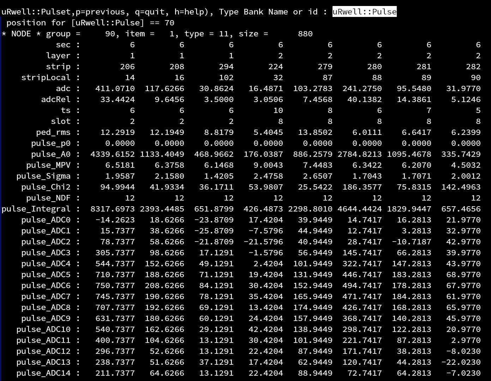
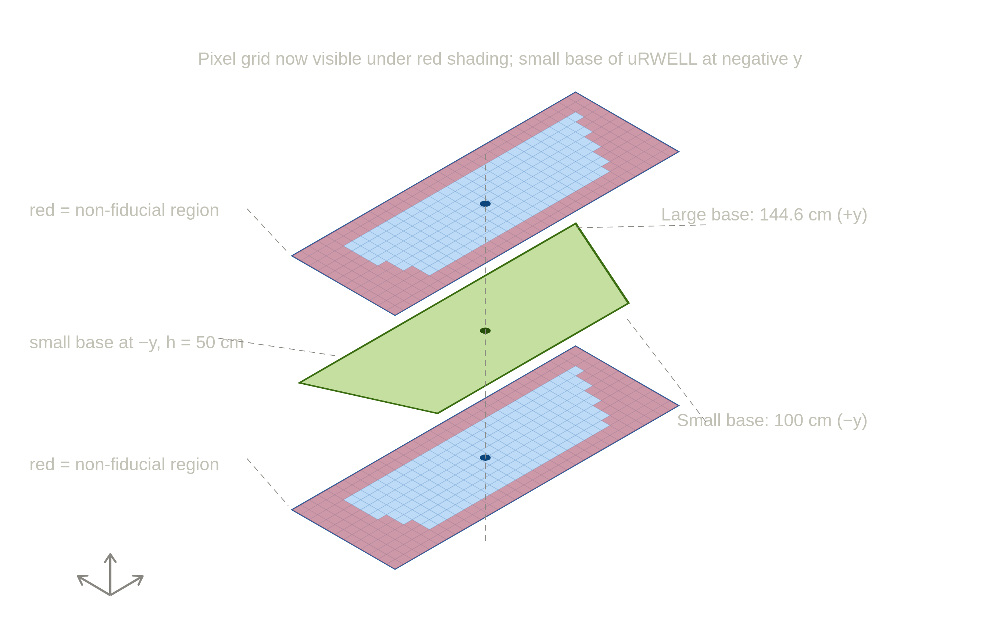
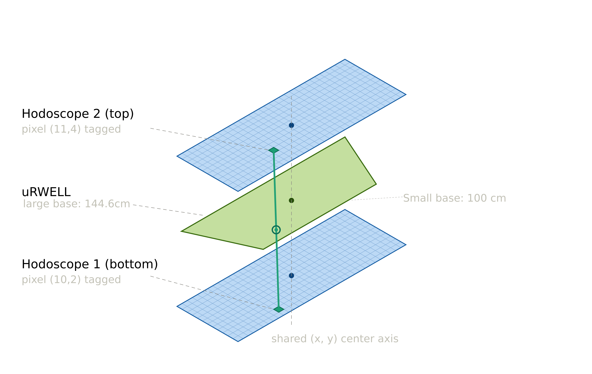
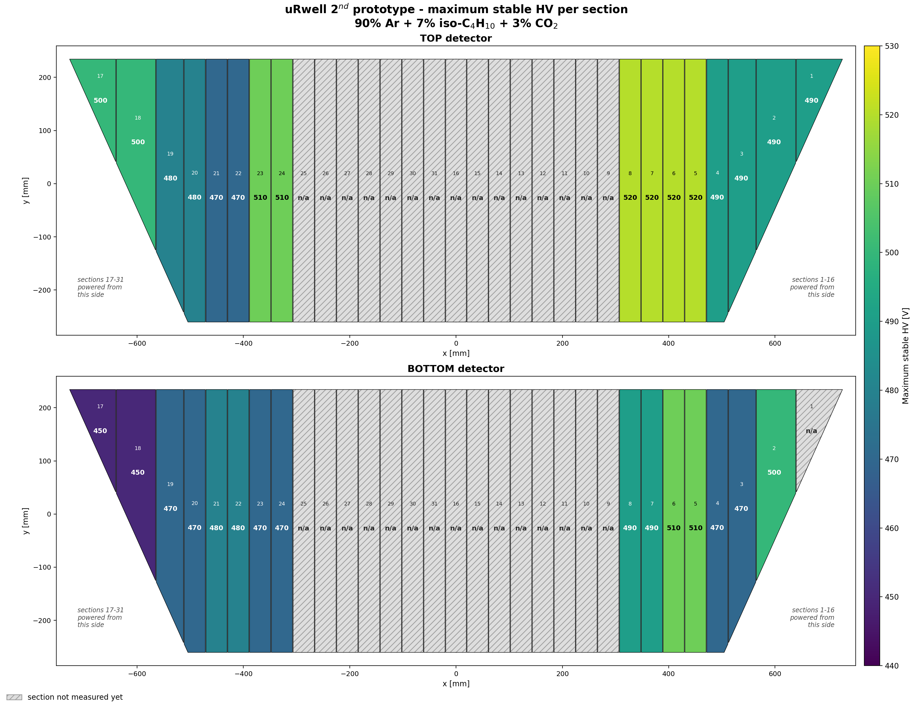
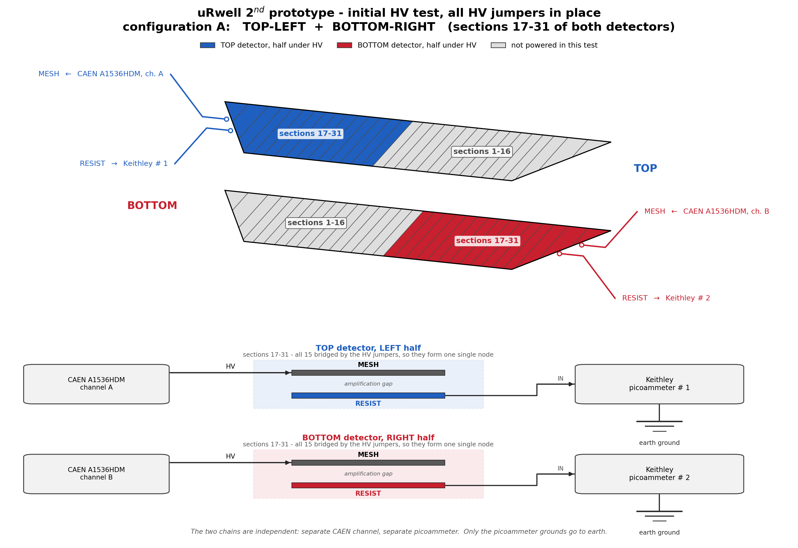
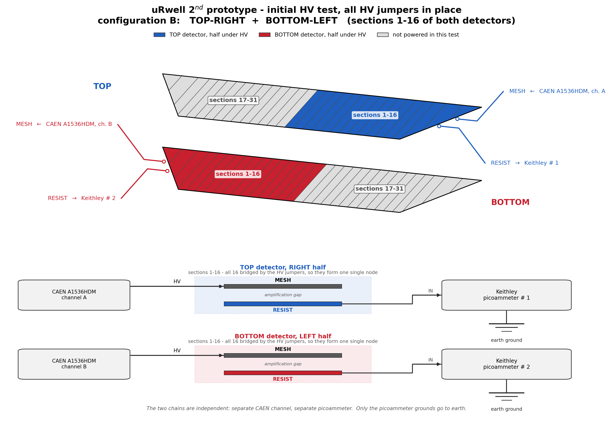
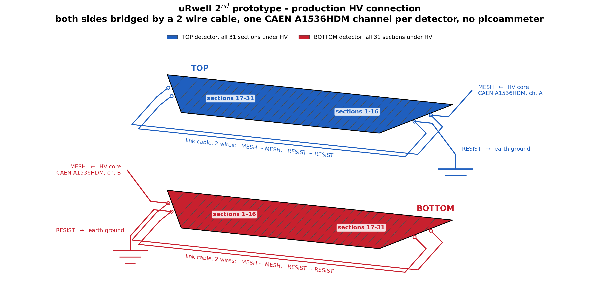

This git repository contains analysis codes/tools for the data collected using the uRwell test prototype.

Check the link https://clasweb.jlab.org/wiki/index.php/Test_Proto_Documents for more details on the uRwell Test Prototype and also
for instructions on Software installation and running.

---

# Table of Contents

1. [Project Overview](#project-overview)
2. [Project Structure](#project-structure)
3. [Installation](#installation)
4. [Analysis Workflow](#analysis-workflow)
   - [Pedestal Runs](#pedestal-runs)
   - [Decoding](#decoding)
   - [Skimming & Pulse Fitting](#skimming--pulse-fitting)
   - [Analysis](#analysis)
   - [Double-Hodoscope Analysis](#double-hodoscope-analysis)
   - [HV Dependence Scans](#hv-dependence-scans)
5. [Standalone C++ Decoder (`Decoder/`)](#standalone-c-decoder-decoder)
6. [Automated Running](#automated-running)
7. [Plotting & Visualization Scripts](#plotting--visualization-scripts)
8. [HV Section Quality](#hv-section-quality)
9. [Event Viewer](#event-viewer)
10. [Geometry Utilities in uRwellTools](#geometry-utilities-in-urwelltools)
11. [Key Analysis Parameters](#key-analysis-parameters)
12. [Data File Locations](#data-file-locations)

---

# Project Overview

This project provides a complete data analysis chain for the μRwell (microRwell) test prototype detector,
a micro-pattern gaseous detector to be added in CLAS12 detector in Hall-B at Jefferson Lab.
The detector is currently read out via APV25 chips.

The analysis chain proceeds from raw EVIO files through decoding, zero-suppression with pulse fitting,
clustering and Analysis coded. It also provides several Drawing programs to generate final plots.

**Detector at a glance:**
- 704 U strips + 704 V strips (1408 total channels)
- 12 readout slots (APV25-based)
- Strip pitch: 1 mm, strip angle: 10°
- Active area: X ∈ [−723, +723] mm, Y ∈ [−250, +250] mm (trapezoidal)
- 15 time samples per waveform at 25 ns per sample. This parameter is not always 15 can be changed in Data acquisition

---

# Project Structure

```
uRWellTestProto/
├── AnaCodes/                       # Analysis executables and scripts
│   ├── Skim_PulseFit.cc            # Zero-suppression + Landau pulse fitting
│   ├── AnaPulseFits.cc             # Clustering, cross reconstruction, histogramming
│   ├── AnaSecondProtoDoubleHodo.cc # Double-hodoscope analysis (second prototype)
│   ├── HV_Scan_SecondProtoDoubleHodo.cc  # HV-dependence plots for double-hodo runs
│   ├── CheckDecoding.cc            # Diagnostic check of decoded data
│   ├── AnaClustering.cc            # Legacy clustering (zero-suppressed input)
│   ├── CalcPedestals.py            # One-command pedestal calculation (decode → CheckDecoding → DrawPedestals)
│   ├── DrawPedestals.cc            # Pedestal extraction and plots (ROOT macro)
│   ├── DrawPulseFitPlots.cc        # Visualization of pulse fit results (ROOT macro)
│   ├── DrawPlotsWithClustering.cc  # Cluster analysis visualization (ROOT macro)
│   ├── DrawHVDependencePlots.cc    # Efficiency vs. HV plots (ROOT macro)
│   ├── DrawEffWithHodo.cc          # Efficiency with hodoscope matching (ROOT macro)
│   ├── DrawNoise_Vs_StripCoorelations.cc  # Noise correlations (ROOT macro)
│   ├── UpdateStripSigmas.cc        # Update per-strip sigma parameters (ROOT macro)
│   ├── RunAnaChain.py              # Automated full-chain analysis script (first prototype)
│   ├── RunSecondProtoAnaChain.py   # Automated full-chain analysis script (second prototype)
│   ├── Decode_Run.py               # Standalone decoding script
│   └── CMakeLists.txt
├── Decoder/                        # Standalone C++ EVIO→HIPO decoder (no coatjava dependency)
│   ├── uRwellDecoder.cc            # Main: decode (URWELL::adc/XYHODO::tdc) or fused --pulse
│   ├── uRwellSRSDecoder.{h,cpp}    # SRS-APV decode (port of coatjava getDataEntries_57631)
│   ├── MarocHodoDecoder.{h,cpp}    # MAROC hodoscope decode (port of getDataEntries_57655)
│   ├── TranslationTable.{h,cpp}    # CCDB translation-table reader (reads the sqlite directly)
│   ├── HipoBankWriter.{h,cpp}      # Writes URWELL::adc / XYHODO::tdc / RUN::config
│   ├── PulseFitWriter.{h,cpp}      # --pulse: writes uRwell::Pulse (port of Skim_PulseFit)
│   ├── CompareDecoded.cc           # Validate URWELL::adc / XYHODO::tdc vs another HIPO file
│   ├── ComparePulse.cc             # Validate uRwell::Pulse vs another HIPO file
│   ├── evio-5.2/                   # Vendored EVIO-5.2 C library
│   └── CMakeLists.txt
├── EventViewer/                    # Interactive ROOT-GUI event display (reads HIPO or raw EVIO)
│   ├── uRwellEventViewer.cc        # Main: builds the GUI and event loop
│   ├── EVMainFrame.{h,cc}          # Top-level window, tab container, navigation/file controls
│   ├── EVReader.{h,cc}             # HIPO event reader (EVReaderBase interface)
│   ├── EVEvioReader.{h,cc}         # Raw-EVIO reader (decode-on-the-fly)
│   ├── EVEvent.h                   # Per-event data passed to the tabs
│   ├── EVHitsTab.{h,cc}            # Hits display tab
│   ├── EVClustersTab.{h,cc}        # Clusters display tab
│   ├── EVPulsesTab.{h,cc}          # Per-strip pulse-fit display tab
│   ├── EVRawDataTab.{h,cc}         # Raw ADC waveform tab
│   ├── EVHodoHitsTab.{h,cc}        # Hodoscope hits tab (short/long bars, PMT1/PMT2)
│   ├── EVHodoCrossesTab.{h,cc}     # Hodoscope crosses tab (matched crosses)
│   ├── EVCutEngine.{h,cc}          # Shared cut logic applied across tabs
│   ├── EVGeometry.{h,cc}           # Drawing geometry helpers
│   └── CMakeLists.txt
├── include/
│   └── uRwellTools.h               # Core data structures, analysis utilities, and geometry tools
├── src/
│   └── uRwellTools.cc              # Implementation of uRwellTools
├── hipo/hipo4/                     # HIPO4 I/O library (header-only, included)
├── cmake_modules/                  # CMake find-modules (FindLZ4, etc.)
├── misc/                           # Standalone tools, not part of the main analysis chain
│   ├── HVScans/                    # HV scan plotter (HVScanPlotter.py)
│   └── HV_Section_Quality/         # Max stable HV of the 31 HV sections, both detectors
├── Doc/                            # Documentation assets (images)
├── PedFiles/                       # Pedestal and noise files (generated)
├── Skims/                          # Skimmed HIPO files (generated)
├── Data/                           # Decoded HIPO files (generated)
├── Figs/                           # Output plots (generated)
├── Pars/                           # Per-strip parameter files (generated)
└── CMakeLists.txt                  # Root build configuration
```

---

# Installation

### Prerequisites

You need to have the **LZ4** library and the **XYHodoTools** package installed.

#### LZ4
Available at https://lz4.org/.
On JLab ifarms or any machine with `/group/clas12` mounted, LZ4 is detected automatically.
Otherwise, point to your installation in `cmake_modules/FindLZ4.cmake`.

#### XYHodoTools
Download from https://code.jlab.org/hallb/XYHodo.

### Installing μRwellTools

1. Clone the repository:
   ```bash
   git clone git@github.com:rafopar/uRWellTestProto.git
   ```
2. Build and install:
   ```bash
   cmake -S . -Bbuild -DCMAKE_INSTALL_PREFIX=/path/to/install/
   cmake --build build
   cmake --install build
   ```

The build also produces the standalone C++ decoder, installed under a separate
`decoder/bin` subdirectory (see [Standalone C++ Decoder](#standalone-c-decoder-decoder)).

---

# Analysis Workflow

## Data Flow

The recommended path uses the standalone C++ decoder in its fused `--pulse` mode, which
**unifies decoding and skimming into a single pass** — the large `URWELL::adc` intermediate
is never written to disk:

```
Raw EVIO files
      │
      ▼
[uRwellDecoder.exe --pulse]    ← C++ decoder, requires PedFiles/Peds_<RUN>
      │  Skims/Skim_PulseFit_<RUN>_<FileNo>.hipo   (decode + pulse-fit fused)
      ▼
[analysis executable]          ← e.g. AnaPulseFits.exe or AnaSecondProtoDoubleHodo.exe
      │  <Ana>_<RUN>_File_<FileNo>.root
      ▼
[hadd]
      │  <Ana>_<RUN>.root   (final unified output)
      ▼
[ROOT plotting macros]
```

> **Two-step alternative.** If you also need the full decoded `URWELL::adc` file (e.g. to
> re-skim with a different threshold or pedestals), run decoding and skimming as separate steps
> instead:
>
> ```
> Raw EVIO → [uRwellDecoder.exe] → Data/decoded_<RUN>_<FileNo>.hipo
>          → [Skim_PulseFit.exe]  → Skims/Skim_PulseFit_<RUN>_<FileNo>.hipo → analysis → ...
> ```

---

## Pedestal Runs

Pedestal runs are taken with a random trigger and lower HV so that no real signal is present.
Approximately 2000 events are sufficient (< 1 minute of data taking).

### Recommended: one-command pedestal calculation

`CalcPedestals.py` runs the entire pedestal chain — **decode → `CheckDecoding.exe` →
`DrawPedestals.cc`** — for you. This is the default way to produce pedestals; you should not
need to run the steps manually.

```bash
python3 CalcPedestals.py <RUN> [-i <EVIO_DIR>] [-n <N_EVENTS>]
```

| Argument | Default | Description |
|---|---|---|
| `<RUN>` | — | Run number (required), e.g. `3261` |
| `-i`, `--indir` | `/volatile/clas12/rafopar/uRwell/Data/BigProto/` | Directory holding the raw EVIO file |
| `-n`, `--nevents` | `2000` | Number of events to decode (2000 is enough for pedestals) |

Example:
```bash
python3 CalcPedestals.py 3261
python3 CalcPedestals.py 3261 -i /path/to/evio/dir -n 5000
```

The final step (`DrawPedestals.cc`) calculates the mean and RMS (noise) for every channel,
produces diagnostic plots in `Figs/`, and writes the results to:
- `PedFiles/Peds_<RUN>` — μRwell pedestals and noise
- `PedFiles/GEM_Peds_<RUN>` — GEM pedestals and noise

### Manual steps (only if you need them individually)

The three steps `CalcPedestals.py` automates are:

```bash
# 1) decode ~2000 events
uRwellDecoder.exe -i <EVIO_DIR>/urwell_maroc_00<RUN>.evio.00000 -o Data/decoded_<RUN>_0.hipo -r <RUN> -n 2000
# 2) diagnostic check of the decoded data
./CheckDecoding.exe <RUN> 0
# 3) extract and plot the pedestals
root -l 'DrawPedestals.cc(<RUN>)'
```

**Linking pedestals to a production run:**
If you want production run 3333 to use pedestals from run 1234:
```bash
ln -s Peds_1234 PedFiles/Peds_3333
ln -s GEM_Peds_1234 PedFiles/GEM_Peds_3333
```

---

## Decoding

The recommended decoder is the bundled **standalone C++ decoder** (`Decoder/`). It produces the
same `URWELL::adc` and `XYHODO::tdc` banks as the old coatjava decoder, but with **no Java
dependency** and a faster runtime, and it can fuse the skim step into the same pass (`--pulse`).

```bash
uRwellDecoder.exe -i inpFile.evio -o Data/decoded_<RUN>_<FileNo>.hipo
```

See [Standalone C++ Decoder](#standalone-c-decoder-decoder) for all options, the fused
`--pulse` mode, and validation against coatjava.

After decoding, the HIPO file contains two key banks:
- `XYHODO::tdc` — hodoscope hits that pass threshold
- `URWELL::adc` — raw ADC waveforms for all 1408 μRwell channels (no online zero-suppression)

### Deprecated: coatjava (Java) decoder

> **Deprecated.** The Java/coatjava decoder is retained for reference and cross-validation only.
> New workflows should use the C++ decoder above.

Historically, raw EVIO files were decoded with a special branch of coatjava optimised for the
μRwell decoder (the standard branch is ~10× slower):

```bash
git clone git@github.com:JeffersonLab/clas12-offline-software.git
git checkout iss1008-urWellDecoder
```

The CCDB environment variable must point to the sqlite file:
```bash
export CCDB_CONNECTION="sqlite:////group/clas12/users/rafopar/uRWellImportant/clas12SecondProto.sqlite"
```
*(The triple slash before `/group` is intentional.)*

Decode a single file:
```bash
/path/to/decoder -i inpFile.evio -o Data/decoded_<RUN>_<FileNo>.hipo -c 1
```

---

## Skimming & Pulse Fitting

Because all 1408 channels are read out every event, the raw files are large and slow to process.
`Skim_PulseFit.exe` applies zero-suppression and fits each above-threshold pulse with a Landau function,
producing compact HIPO files for downstream analysis.

> **Note:** With the C++ decoder's fused `--pulse` mode this step is done as part of decoding and
> you can skip `Skim_PulseFit.exe` entirely (see [Data Flow](#data-flow) and
> [Fused Pulse-Fit Mode](#fused-pulse-fit-mode---pulse)). Run `Skim_PulseFit.exe` separately only
> when you decoded to a full `URWELL::adc` file first.

**Run:**
```bash
./Skim_PulseFit.exe -r <RUN> -f <FileNo>
```

**Input:** `Data/decoded_<RUN>_<FileNo>.hipo` + `PedFiles/Peds_<RUN>`

**Output:** `Skims/Skim_PulseFit_<RUN>_<FileNo>.hipo`

> **Note:** The `Skims/` directory must exist before running.

### Pulse Fitting Details

For each channel, the waveform (up to 15 time samples, 25 ns each) is compared to the pedestal.
Bins where ADC > 3σ (pedestal RMS) are considered hits. All qualifying pulses are fitted with:

```
f(x) = A · Landau(x, MPV, σ)
```

where **A** is the amplitude, **MPV** is the Most Probable Value, and **σ** is the width.

### Format of the Skimmed File (`uRwell::Pulse` bank)

The picture below shows one example event from the `uRwell::Pulse` bank:



| Field | Description |
|---|---|
| `sec` | Sector: 6 = μRwell, 8 = GEM |
| `layer` | 1 = U layer, 2 = V layer |
| `strip` | Global strip number (1–704) |
| `stripLocal` | Strip number within the readout chip (1–128) |
| `adc` | Total ADC of the signal divided by number of time samples |
| `adcRel` | ADC divided by the strip noise σ (signal-to-noise ratio) |
| `ts` | Time sample index of the highest ADC bin (0 to n_ts − 1) |
| `slot` | Readout board (slot) number |
| `ped_rms` | RMS (noise) of the strip — constant across events |
| `pulse_A0` | Amplitude A of the Landau fit |
| `pulse_MPV` | MPV of the Landau fit |
| `pulse_Sigma` | Width σ of the Landau fit |
| `pulse_Chi2` | Chi² of the fit |
| `pulse_NDF` | Number of degrees of freedom |
| `pulse_ADCN` | Raw ADC in time sample N (N = 0–14) |

---

## Analysis

At this stage there are **several analysis executables**, each reading the skimmed
`uRwell::Pulse` data and doing something different. Choose the one appropriate for your study:

| Executable | Output | Purpose |
|---|---|---|
| `AnaPulseFits.exe` | `AnaPulseFits_<RUN>_File_<FileNo>.root` | Clustering, U×V cross reconstruction, hodoscope correlation, timing |
| `AnaSecondProtoDoubleHodo.exe` | `AnaSecondHodoDoubleHodo_<RUN>_File_<FileNo>.root` | Double-hodoscope analysis for the second prototype |
| `AnaClustering.exe` | `AnaClustering_<RUN>_*.root` | Legacy clustering on zero-suppressed input |

They share the same basic invocation:

```bash
./<AnalysisExecutable> -r <RUN> -f <FileNo>
```

**Input:** `Skims/Skim_PulseFit_<RUN>_<FileNo>.hipo`

The per-file ROOT outputs are then merged with `hadd` into a single `<Ana>_<RUN>.root` file.
The [automated chain](#automated-running) runs the selected analysis and its `hadd` for you.

The remainder of this section documents `AnaPulseFits.exe` as a representative example.

### Example: AnaPulseFits

`AnaPulseFits.exe` performs clustering, U×V cross reconstruction, hodoscope correlation, and
timing analysis on the skimmed data.

**Run:**
```bash
./AnaPulseFits.exe -r <RUN> -f <FileNo>
```

**Input:** `Skims/Skim_PulseFit_<RUN>_<FileNo>.hipo`

**Output:** `AnaPulseFits_<RUN>_File_<FileNo>.root`

#### Analysis Steps

1. **Hodoscope analysis** — reconstruct matched crosses from the XYHodoscope TDC bank.
   A "clean" event requires exactly 1 left-right matched cross (`nLR_MatchedCross == 1`).

2. **Pulse reading** — loop over `uRwell::Pulse` bank entries for sector 6 (μRwell),
   separating hits into U-layer and V-layer pulse lists.

3. **Clustering** — adjacent pulses within 2-strip gaps are merged into `PulseCluster` objects.
   For each cluster the following are computed:
   - Seed pulse (highest integral)
   - Integral-weighted cluster center (strip coordinate)
   - Integral-weighted cluster MPV and σ
   - Cluster start time = Cluster MPV − Cluster σ

4. **Quality cuts** — applied to the seed pulse:
   - Pulse sigma: 1.2 ≤ σ ≤ 5.2

5. **Cross reconstruction** — the highest-integral U cluster and V cluster are paired to form
   a μRwell cross. X and Y detector coordinates are computed from the strip numbers
   using the 10° strip geometry.

6. **Active area cut** — crosses are required to be within the detector active area
   (used as numerator of the detection efficiency with the Hodo tag as denominator).

7. **Histogram filling** — 1D and 2D histograms are filled covering:
   - Pulse parameter distributions (MPV, σ, integral, χ²/NDF)
   - Cluster and seed properties vs. strip/slot
   - Cross X-Y positions
   - Timing differences Δt between U and V clusters
   - Correlations with hodoscope bar IDs
   - Per-pixel timing maps (coarse 20×10 grid)

#### Efficiency Calculation

The detection efficiency per hodoscope pixel is.

For each hodoscope pixel, the μRwell detection efficiency is calculated the following way

```
efficiency[shortBarID][longBarID] =
    h_Cross_YXC_Max1_[shortBarID][longBarID]   (U∧V cluster + active area + Hodo tag)
    ─────────────────────────────────────────
    h_Hodo_XY_BarID_Tag1[shortBarID][longBarID] (Hodo tag only)
```
NOTE: with only single hodoscope, there will be non-negligible amount of cosmic tracks passing therough
the hodoscope, but missing the μRwell. So actuall efficiency of the μRwell close to the edges will be higher
the ratio defined above.

---

## Double-Hodoscope Analysis

`AnaSecondProtoDoubleHodo.exe` is the analysis for the **second prototype**, which has **two**
XY-hodoscopes (one above and one below the μRwell) instead of one. The two hodoscope crosses define
a straight cosmic track, giving a much cleaner efficiency denominator than a single hodoscope (which
suffers from cosmics that clip the hodoscope but miss the μRwell — see the note in
[Efficiency Calculation](#efficiency-calculation)).

The two hodoscopes sit above and below the trapezoidal μRwell, sharing a common (x, y) center
axis. A hodoscope pixel is **fiducial** only if its vertical projection falls inside the μRwell
active area; the blue region below is fiducial and the red region is not:



A clean event has one matched cross in each hodoscope. The two crosses (one pixel per plane) define
the cosmic track, which is required to be fiducial in **both** planes before it is used as an
efficiency-denominator track:



**Run:**
```bash
./AnaSecondProtoDoubleHodo.exe -r <RUN> -f <FileNo>
```

**Input:** `Skims/Skim_PulseFit_<RUN>_<FileNo>.hipo`

**Output:** `AnaSecondHodoDoubleHodo_<RUN>_File_<FileNo>.root`

### Analysis Steps

1. **Both hodoscopes** — each `XYHODO::tdc` detector (det0 and det1) is analysed with its own
   `XYHodoAnalyzer`, using the same time cuts as `AnaPulseFits.exe` (`T_OverThrCut`,
   `deltaT_Cut_Cross`, `deltaT_Cut_PMT12_Match`, all 20 ns).

2. **Clean event** — the event is kept only if **each** hodoscope has exactly one left–right matched
   cross (`nLR_MatchesDet0 == 1 && nLR_MatchesDet1 == 1`). The two crosses' short/long bar IDs define
   the track.

3. **Fiducial (track) cut** — the track is required to project inside the μRwell active area for
   **both** hodoscope crosses (`IsHodoPixelInsideuRwell` for det0 and det1). Fiducial tracks fill the
   occupancy map `h_Det0_Occupancy_Fiducial1` — the efficiency **denominator**.

4. **μRwell reconstruction** — `uRwell::Pulse` hits (sector 6) are split into U/V, quality-cut on the
   seed pulse (1.2 ≤ σ ≤ 5.2), clustered (min 2 hits), and paired into the highest-integral U×V cross.
   Fiducial events with a reconstructed cross fill `h_Cross_YXc_MaxIntegral_Fiducial1` — the efficiency
   **numerator**.

5. **Histogram filling** — cluster sizes (`h_UCl_Size2` / `h_VCl_Size2`), pulse height/integral
   (`h_U/V_PulseHeight2`, `h_U/V_PulseIntegral2`), neighbour Δ-start-time distributions, and the
   occupancy/cross maps. These are exactly the histograms the [HV scan](#hv-dependence-scans) reads.

The efficiency is then `h_Cross_YXc_MaxIntegral_Fiducial1 / h_Det0_Occupancy_Fiducial1`.

The per-file ROOT outputs are merged with `hadd` into `AnaSecondHodoDoubleHodo_<RUN>.root` — done for
you by the [automated chain](#automated-running) (`--ana=doublehodo`) — which is the input consumed by
`HV_Scan_SecondProtoDoubleHodo.exe`.

---

## HV Dependence Scans

`HV_Scan_SecondProtoDoubleHodo.exe` builds high-voltage dependence plots for the second-prototype
double-hodoscope runs. Given a scan **series**, it reads each run's merged analysis file
`AnaSecondHodoDoubleHodo_<RUN>.root`, extracts a set of observables from the histograms, and plots
each one as a function of the high voltage.

**Run:**
```bash
./HV_Scan_SecondProtoDoubleHodo.exe <Series> <ScanType> [inputDir]
# e.g.
./HV_Scan_SecondProtoDoubleHodo.exe 1 MESH
```

The runs and their HV settings for a series are listed in `SecondProtoHVScan_<Series>.dat`, with columns:

```
<Run>  <HV_MESH_Top>  <HV_MESH_Bot>  <HV_Cathode_Top>  <HV_Cathode_Bot>
```

The meaning of the HV (x) axis is set by `<ScanType>` (Drift HV = Cathode HV − MESH HV):

| ScanType | HV axis |
|---|---|
| `MESH` | common mesh HV (`HV_MESH_Top`, expects Top == Bot) |
| `Drift` | common drift HV (`HV_Cathode_Top − HV_MESH_Top`) |
| `MESH_Top` / `MESH_Bot` | top / bottom mesh HV |
| `Drift_Top` / `Drift_Bot` | top / bottom drift HV |

**Observables** are extracted per run. The `h_U...` histograms come from the Top detector and the
`h_V...` from the Bottom detector, and the U/V graphs of an observable are drawn together on one
figure. The currently registered observables are:

| Observable | Source histogram(s) | Extracted quantity |
|---|---|---|
| Cluster size mean | `h_UCl_Size2` / `h_VCl_Size2` | histogram mean |
| Cluster size peak | `h_UCl_Size2` / `h_VCl_Size2` | peak-bin position |
| Pulse integral MPV | `h_U_PulseIntegral2` / `h_V_PulseIntegral2` | Landau-fit MPV (full range) |
| Pulse height MPV | `h_U_PulseHeight2` / `h_V_PulseHeight2` | Landau-fit MPV (0–1000) |
| Efficiency [%] | `h_Cross_YXc_MaxIntegral_Fiducial1`, `h_Det0_Occupancy_Fiducial1` | 100 × ratio of entries (single "combined" graph) |

Adding a new variable is a single entry in `buildObservables()` (U/V observables) or
`buildCombinedObservables()` (single-graph combined observables).

**Outputs** (all in `Figs/`):
- `HVScan_<Observable>_<ScanType>_Series<N>.{pdf,png,root}` — the HV dependence of each observable.
- `Distributions_HV_Scan_<N>.pdf` — one multi-page document with every input distribution used
  for the extractions (histogram, fit, and extracted value), for inspection at a glance.
- `diagnostic_<Variable>_<ScanType>_<HVValue>.pdf` — written **only** when a fit fails, showing the
  histogram with the attempted fit so the failure can be understood.

Whenever a point cannot be produced (missing/empty histogram or a non-converging fit) it is dropped,
the user is notified on the spot, and a summary of all dropped points is printed at the end.

---

# Standalone C++ Decoder (`Decoder/`)

`Decoder/` is a self-contained C++ EVIO→HIPO decoder for the μRwell test-prototype data
(single crate / single FEC). It reproduces the relevant coatjava decoding **without the
coatjava/Java dependency**, and it is faster. It vendors a minimal EVIO-5.2 C library and
reads the CCDB translation tables directly from the sqlite file (no `libccdb`).

> **One intentional deviation from coatjava:** for the half-populated edge APVs (slots 0 and
> 6, which carry 64 μRwell sector-6 strips + 64 sector-7 strips), the common mode is built
> only from the sector-6 strips (`mask >= 64`) for **both** slots. The coatjava
> `getDataEntries_57631` used the sector-7 half for slot 6, biasing its common mode high; this
> decoder fixes that, so its decoded slot-6 ADC values differ from coatjava by design.

It builds as part of the normal `cmake --build build` and installs to its own subdirectory
`${CMAKE_INSTALL_PREFIX}/decoder/bin`:

| Executable | Purpose |
|---|---|
| `uRwellDecoder.exe` | The decoder (standard mode and fused `--pulse` mode) |
| `CompareDecoded.exe` | Compare `URWELL::adc` / `XYHODO::tdc` of two HIPO files (order-insensitive multiset) |
| `ComparePulse.exe` | Compare `uRwell::Pulse` of two HIPO files (multiset, keyed by `RUN::config.event`) |

## Decoding (standard mode)

```bash
uRwellDecoder.exe -i inpFile.evio -o Data/decoded_<RUN>_<FileNo>.hipo
```

| Option | Default | Description |
|---|---|---|
| `-i <file>` | — | Input EVIO file (**required**) |
| `-o <file>` | — | Output HIPO file (**required**) |
| `-r <run>` | parsed from filename `urwell_maroc_<run>` | Run number (for CCDB resolution) |
| `-n <N>` | all | Decode at most N events |
| `-v <variation>` | `default` | CCDB variation |
| `--ccdb <conn>` | `sqlite:////group/clas12/users/rafopar/uRWellImportant/clas12SecondProto.sqlite` | CCDB connection string |
| `-c <n>` | ignored | Accepted for coatjava CLI compatibility (compression type) |

The output banks (`URWELL::adc`, `XYHODO::tdc`, `RUN::config`) match the coatjava decoder
**when the same CCDB is used**, except for the intentional slot-0/6 common-mode fix noted
above (which shifts slot-6 `URWELL::adc` values). Verified for run 3208 with the default
`clas12SecondProto.sqlite` via `CompareDecoded.exe`.

> The CCDB must contain the μRwell translation table. The built-in default
> `clas12SecondProto.sqlite` is the one used by `RunSecondProtoAnaChain.py`; override with
> `--ccdb` if you need a different one.

## Fused Pulse-Fit Mode (`--pulse`)

`--pulse` performs the decoding **and** the `Skim_PulseFit` step in a single pass. Instead of
writing the large `URWELL::adc` bank it builds the strip waveforms, keeps only strips above the
3σ threshold, Landau-fits each one, and writes the compact `uRwell::Pulse` bank directly (plus an
empty `RAW::adc`, `RUN::config`, and `XYHODO::tdc`). This avoids writing and re-reading the
multi-GB decoded intermediate file.

```bash
uRwellDecoder.exe -i inpFile.evio -o Skims/Skim_PulseFit_<RUN>_<FileNo>.hipo \
    --pulse --peds-dir PedFiles
```

| Option | Default | Description |
|---|---|---|
| `--pulse` | off | Write `uRwell::Pulse` instead of `URWELL::adc` |
| `--peds-dir <dir>` | `PedFiles` | Directory holding `Peds_<RUN>` and `GEM_Peds_<RUN>` |

Requirements and behaviour:
- Needs `<peds-dir>/Peds_<RUN>` (μRwell, sector 6) and `<peds-dir>/GEM_Peds_<RUN>` (GEM,
  sector 8) — exactly the files `Skim_PulseFit` uses. The GEM file may be empty if the run has
  no GEM channels.
- The `uRwell::Pulse` output is a direct port of `AnaCodes/Skim_PulseFit.cc`, so the threshold,
  fit function, and bank format are the same (see
  [Skimming & Pulse Fitting](#skimming--pulse-fitting)). The result is **bit-identical** to the
  two-step `decode → Skim_PulseFit` (verified with `ComparePulse.exe` on run 3208: 167 events,
  619 pulses, 0 mismatching rows).

**Performance (per 1000 events, run 3208, warm cache):** the fused path is ~31% faster in
wall-clock (~27.5 s vs ~22.5 s decode + ~17.4 s skim) and eliminates the ~55 MB-per-1000-events
`URWELL::adc` intermediate (~2.8 GB for a full EVIO file). The Landau fit is the dominant cost and
is unchanged; the saving comes from not writing/reading the giant bank.

> **Trade-off:** because the `URWELL::adc` bank is never written, you cannot re-skim with a
> different threshold or different pedestals without re-decoding from EVIO. Use the standard mode
> if you also need the full decoded file for other analyses.

## Validation

```bash
# decoded banks vs another decoded file (e.g. C++ vs coatjava)
CompareDecoded.exe fileA.hipo fileB.hipo

# uRwell::Pulse of the fused output vs a decode → Skim_PulseFit output
ComparePulse.exe merged.hipo Skims/Skim_PulseFit_<RUN>_<FileNo>.hipo
```

Both tools report the number of mismatching events/rows and print `IDENTICAL` on a perfect match.

---

# Automated Running

`RunSecondProtoAnaChain.py` runs the full analysis chain in parallel on a multi-core machine.
It is **not recommended on JLab ifarms** (use batch jobs there instead).

```bash
python3 RunSecondProtoAnaChain.py <RUN> [START_TASK] [--ana=pulsefit|doublehodo|both]
```

The script launches up to 18 parallel jobs, waits until ≤ 8 are still running, then submits
the next batch. Decoding and skimming always run first; after `TASK_SkimPulseFit` the
analysis selected with `--ana` is run (and its per-file ROOT outputs merged). The available
tasks are:

| Task name | Description | Typical time per file |
|---|---|---|
| `TASK_DECODE` | Decode EVIO → HIPO | ~30 min |
| `TASK_SkimPulseFit` | Run `Skim_PulseFit.exe` | ~30 min |
| `TASK_AnaPulseFit` | Run `AnaPulseFits.exe` → `AnaPulseFits_<RUN>_File_<FileNo>.root` | < 20 s |
| `TASK_Hadd_pulsefit` | Merge `AnaPulseFits_<RUN>_File_*.root` → `AnaPulseFits_<RUN>.root`, then remove inputs | seconds |
| `TASK_AnaDoubleHodo` | Run `AnaSecondProtoDoubleHodo.exe` → `AnaSecondHodoDoubleHodo_<RUN>_File_<FileNo>.root` | < 20 s |
| `TASK_Hadd_doublehodo` | Merge `AnaSecondHodoDoubleHodo_<RUN>_File_*.root` → `AnaSecondHodoDoubleHodo_<RUN>.root`, then remove inputs | seconds |

**Selecting the analysis (`--ana`):** choose which analysis to run after skimming.
- `--ana=pulsefit` — only `AnaPulseFits.exe`
- `--ana=doublehodo` — only `AnaSecondProtoDoubleHodo.exe`
- `--ana=both` — both, one after another (**default**)

`AnaPulseFits.exe` and `AnaSecondProtoDoubleHodo.exe` are independent programs; each task is
followed by its own `hadd` step that merges the matching per-file ROOT files.

The `[START_TASK]` argument is optional. If omitted, the chain starts from `TASK_DECODE`.
To resume from a later step (e.g. if decoding is already done):

```bash
# Skim + both analyses, starting from skimming
python3 RunSecondProtoAnaChain.py 3333 TASK_SkimPulseFit

# Only the double-hodo analysis, starting from its task (skim already done)
python3 RunSecondProtoAnaChain.py 3333 TASK_AnaDoubleHodo --ana=doublehodo
```

---

# Plotting & Visualization Scripts

These ROOT macros are run interactively with `root -l`. They read the output of the analysis
executables and produce PDF/PNG plots in the `Figs/` directory.

| Script | Input | Description |
|---|---|---|
| `DrawPedestals.cc` | `CheckDecoding_<RUN>_0.root` | Fits pedestal distributions, writes `PedFiles/Peds_<RUN>` |
| `DrawPulseFitPlots.cc` | `AnaPulseFits_<RUN>.root` | Pulse fit parameter distributions |
| `DrawPlotsWithClustering.cc` | `AnaPulseFits_<RUN>.root` | Cluster size, position, and charge |
| `DrawHVDependencePlots.cc` | multiple runs | Efficiency vs. detector HV |
| `DrawEffWithHodo.cc` | `AnaPulseFits_<RUN>.root` | Detection efficiency with hodoscope tagging; also produces a TF2-based 2D map of the normalized U−V strip RO-length difference across the detector face (`Figs/Str_ROLength_Diff.*`) |
| `DrawNoise_Vs_StripCoorelations.cc` | `CheckDecoding_<RUN>_0.root` | Strip-to-strip noise correlations |
| `UpdateStripSigmas.cc` | `AnaPulseFits_<RUN>.root` | Updates per-strip σ in `Pars/Pulse_Sigmas_<RUN>.dat` |

---

# HV Section Quality

The active area of the second prototype is divided into **31 HV sections**, and each of them is
characterized separately: the section is ramped up and the highest voltage at which it stays stable
(no leakage current developing, no trips) is recorded. `misc/HV_Section_Quality/` holds those
measurements together with the code that draws them on the real detector geometry.



**Measurements** are two-column text files, one per detector
(`TOP_HV_Sections_90Ar_7Iso_3CO2.dat`, `BOT_HV_Sections_90Ar_7Iso_3CO2.dat`), where a negative value
means the section has not been measured yet. A `#` starts a comment, also at the end of a line,
which is used to record observations about individual sections:

```
# SECTION	MAX_STABLE_HV [V]
1		490
9		-1
20		470  # held 510 for ~30 min, later did not hold 480 for long
```

**Run:**
```bash
cd misc/HV_Section_Quality
./plot_HV_sections.py                                # -> Figs/HV_Section_MaxStableHV.{png,pdf}
./plot_HV_sections.py --cmap RdYlGn --vmin 440 --vmax 530
```

The figures are written into the `Figs/` sub directory, which is created if it does not exist yet.
Both detectors are drawn to scale and share one color scale, so that they can be compared directly.
Sections that are not measured yet are drawn hatched and labelled `n/a`. Further options are
`--top`, `--bot`, `--geometry`, `--output-dir`, `--out`, `--gas` and `--mirror` (the latter flips the
detector in x, for the case it is viewed from the other side). Only `numpy` and `matplotlib` are
needed. To add new measurements, edit the two `.dat` files and re-run the script — nothing else has
to be touched.

**Section geometry** comes from the CAD export `DFS3381_activearea.dxf`, which is *not* part of this
repository. `extract_section_geometry.py` reads it and writes `uRwell_HV_section_geometry.dat`, which
*is* committed, so plotting does not need the CAD file at run time; the extractor has to be re-run
only if the CAD export changes. The active area is a 1453 × 495 mm² trapezoid cut into 31 vertical
sections of ~41 mm pitch, the two outermost ones on each side being clipped by the slanted edges.

**Section numbering** follows the HV connections of `DFS3381_TOP.pdf`. Sections 1–16 are powered from
the right side and 17–31 from the left side, and **both groups are counted from the outer edge of the
detector inwards**, so the numbering is mirror symmetric and the two innermost sections 16 (the
central one) and 31 are neighbours:

```
sec:   17  18  19  ...  30  31 | 16  15  14  ...   2   1
x:   -727 -602 -538     -81 -40 |  0  +40  +81      +602 +727   [mm]
```

**Status** with 90% Ar + 7% iso-C₄H₁₀ + 3% CO₂: TOP sections 1–8 and 17–24 are measured (470–520 V),
BOTTOM sections 2–8 and 17–24 (450–510 V). The whole central band, sections 9–16 and 25–31, is still
to be done on both detectors.

## Initial HV test (all jumpers in place)

Before the section-by-section characterization, both detectors were tested with **all HV jumpers in
place**, so that one complete half of a detector — every section powered from the same side — hangs
on a single CAEN channel: the HV pin feeds the **MESH**, the **RESIST** layer goes into the input of
a Keithley picoammeter and the picoammeter ground goes to earth. Two picoammeters were available, so
two halves were measured at a time, always one per detector and on opposite sides.

The BOTTOM detector is the same uRwell foil flipped left ↔ right, so its sections 1–16 sit on the
**left** and 17–31 on the **right**, opposite to the TOP. The two measured configurations are
therefore:

| configuration | halves under HV | sections |
|---|---|---|
| A | TOP-LEFT + BOTTOM-RIGHT | 17–31 of both detectors (15 each) |
| B | TOP-RIGHT + BOTTOM-LEFT | 1–16 of both detectors (16 each) |




```bash
cd misc/HV_Section_Quality
./plot_HV_initial_test_schematic.py            # -> Figs/HV_InitialTest_{TopLeft_BotRight,TopRight_BotLeft}.{png,pdf}
./plot_HV_initial_test_schematic.py --elev 20 --azim 17     # viewing angle of the 3D sketch
```

Each figure shows a 3D sketch of the two stacked planes in their true trapezoidal shape and section
pitch (TOP blue, BOTTOM red, the energized half filled and the rest grey) together with the wiring of
both measuring chains. The same section geometry file as above is used, nothing else is needed.

## Production HV connection

In production the **left and the right side of a detector are tied together by a 2-wire cable**
(MESH↔MESH and RESIST↔RESIST), so that all 31 sections end up on the same pair of nodes and each
detector needs **one single HV channel**: the core of the HV cable is soldered onto the MESH and the
RESIST goes to **earth ground**. There is no picoammeter any more. The TOP detector is fed from its
**right** side, the BOTTOM detector from its **left** side.



The same script draws it as a third figure:

```bash
./plot_HV_initial_test_schematic.py     # -> Figs/HV_Production_Connection.{png,pdf} as well
```

The HV module is a **CAEN A1536HDM** and is named on all three figures.

---

# Event Viewer

`EventViewer/` builds `uRwellEventViewer.exe`, an interactive ROOT-GUI event display for browsing
individual events. It reads **either** a skimmed HIPO file (with the `uRwell::Pulse` and
`XYHODO::tdc` banks) **or** a raw EVIO file, which it decodes on the fly.

```bash
./uRwellEventViewer.exe <file>
# e.g. a skimmed HIPO file
./uRwellEventViewer.exe Skims/Skim_PulseFit_3208_403.hipo
# e.g. a raw EVIO file (decoded on the fly)
./uRwellEventViewer.exe /path/to/urwell_maroc_003208.evio.00000
```

The input type is chosen from the file name: any name containing `.evio` is treated as raw EVIO,
otherwise it is read as HIPO. Decoding a raw EVIO file on the fly needs the same pedestals and CCDB
as the standalone decoder (`PedFiles/Peds_<RUN>` and a reachable CCDB); the **Raw data** tab
(raw ADC waveforms) is only populated for EVIO input.

**Window layout** — a set of nested tabs, each redrawn as you step through events:

| Tab | Sub-tab | Shows |
|---|---|---|
| uRwell | Raw data | Raw ADC waveforms per channel (EVIO input only) |
| uRwell | Pulses | Per-strip pulse fits (strip, σ, χ²/ndf, …) |
| uRwell | Hits | Reconstructed hits |
| uRwell | Clusters | Reconstructed clusters |
| Hodoscope | Hits | Hodoscope short/long-bar hits (PMT1 blue, PMT2 red) |
| Hodoscope | Crosses | Reconstructed hodoscope crosses (including matched crosses) |

Navigation and file controls (next/previous/goto event, **Open file…**, and **Exit**) are on the
main frame; **Open file…** brings up a dialog that accepts both HIPO (`*.hipo`) and EVIO (`*.evio*`)
files, so you can switch inputs without restarting.

---

# Geometry Utilities in uRwellTools

Two functions in `uRwellTools` compute the distance along the strip direction from a hit
position `(x, y)` to the detector edge where the readout (RO) connectors are located:

```cc
double uRwellTools::getROLength_U(double x, double y);
double uRwellTools::getROLength_V(double x, double y);
```

Both functions:
- Return `-1` if `(x, y)` is outside the active detector area.
- Account for the strip flip point at strip 448.5, where the readout side switches:
  U strips switch from the **left** edge to the **right** edge, and V strips switch from
  the **right** edge to the **left** edge.
- Return the Euclidean distance in **mm** from `(x, y)` along the strip to the boundary
  where the connector sits.

These functions are used in `DrawEffWithHodo.cc` to define a ROOT `TF2` object
(`f_UVStrROLengthDiff`) that maps the normalized (to the speed of light) difference

```
f(x, y) = (getROLength_U(x, y) − getROLength_V(x, y)) / 300
```

across the full detector face, and saves it as `Figs/Str_ROLength_Diff.*`. This visualization
helps study any signal amplitude or timing dependence on the distance to the RO connector.

---

# Key Analysis Parameters

| Parameter | Value | Location | Description                                                   |
|---|---|---|---------------------------------------------------------------|
| Hit threshold | 3σ | `Skim_PulseFit.cc` | Minimum ADC above pedestal to consider a hit                  |
| `PulseSigmaMin` | 1.2 | `AnaPulseFits.cc` | Minimum acceptable Landau σ                                   |
| `PulseSigmaMax` | 5.2 | `AnaPulseFits.cc` | Maximum acceptable Landau σ                                   |
| `chi2NDF_cut` | 40 | `AnaPulseFits.cc` | Maximum χ²/NDF for a pulse (under study), Not being used yet. |
| Cluster gap | 2 strips | `uRwellTools.cc` | Maximum strip gap within a cluster                            |
| `minHits` | 2 | `AnaPulseFits.cc` | Minimum pulses in a cluster to be used                        |
| `T_OverThrCut` | 20 ns | `AnaPulseFits.cc` | Hodoscope over-threshold time cut                             |
| `deltaT_Cut_Cross` | 20 ns | `AnaPulseFits.cc` | Hodoscope cross Δt cut                                        |
| `deltaT_Cut_PMT12_Match` | 20 ns | `AnaPulseFits.cc` | Hodoscope PMT1/2 match Δt cut                                 |
| `sec_uRwell` | 6 | `AnaPulseFits.cc` | Sector ID of the μRwell detector                              |
| `sec_GEM` | 8 | `AnaPulseFits.cc` | Sector ID of the GEM detector                                 |
| Strip flip point | 448.5 | `uRwellTools.cc` | Strip number above which RO connector side switches (U and V) |

---

# Data File Locations

| Type              | Path                                                                        |
|-------------------|-----------------------------------------------------------------------------|
| EVIO              | `Up to the user`                                                            |
| Decoded HIPO      | `Data/decoded_<RUN>_<FileNo>.hipo`                                          |
| Skimmed HIPO      | `Skims/Skim_PulseFit_<RUN>_<FileNo>.hipo`                                   |
| Per-file analysis | `AnaPulseFits_<RUN>_File_<FileNo>.root`                                     |
| Merged analysis   | `AnaPulseFits_<RUN>.root`                                                   |
| Pedestals         | `PedFiles/Peds_<RUN>`, `PedFiles/GEM_Peds_<RUN>`                            |
| Per-strip σ       | `Pars/Pulse_Sigmas_<RUN>.dat`                                               |
| Plots             | `Figs/`                                                                     |
| CCDB sqlite       | `Up to the user: Just make sure to properly set the CCDB_CONNECTUION to it` |


[comment]: <> ( ## Clone the package )

[comment]: <> (Package has a dependency on hipo library, which is a submodule. )
[comment]: <> (Use the command: )
[comment]: <> ( )
[comment]: <> (``` )
[comment]: <> (git clone --recurse-submodules git@github.com:rafopar/uRWellTestProto.git )
[comment]: <> ( )
[comment]: <> (to clone the distribution. )
